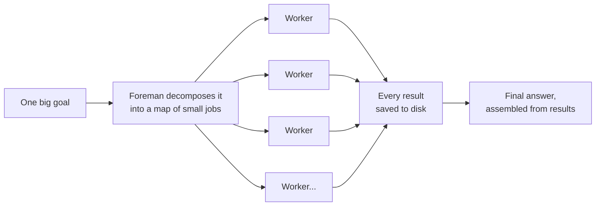
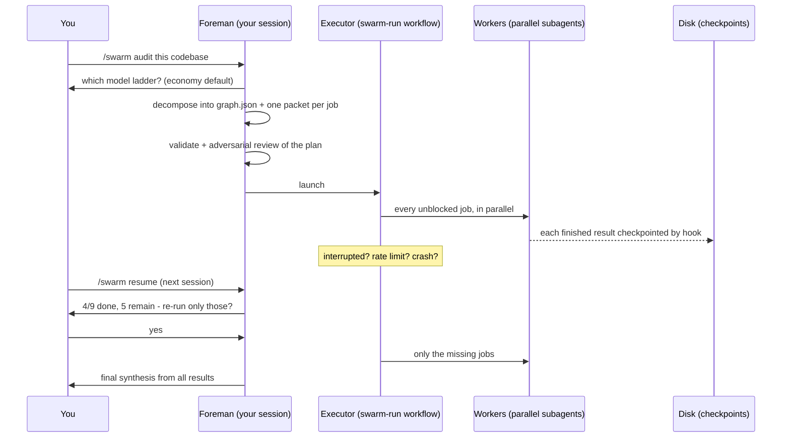
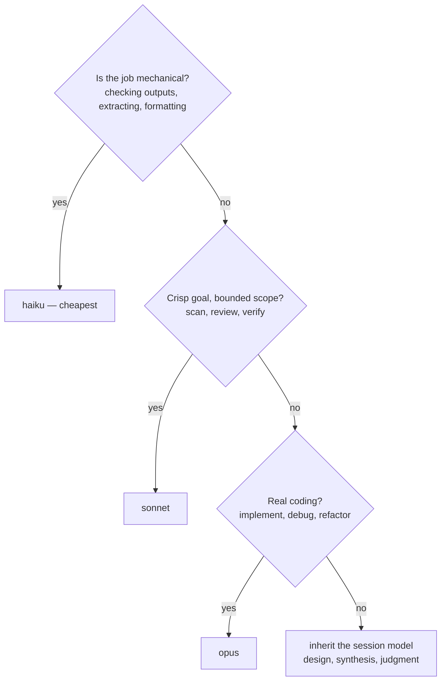
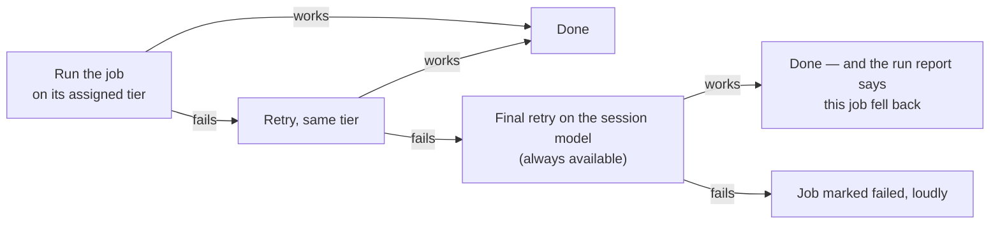
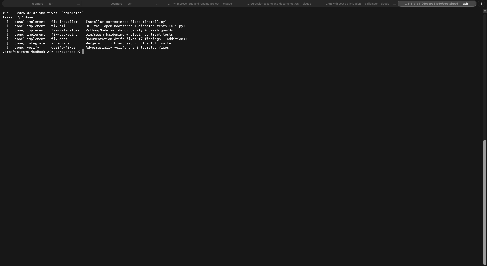
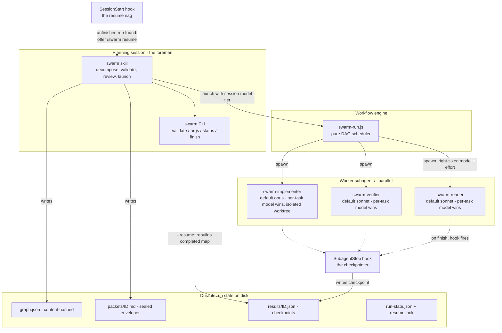
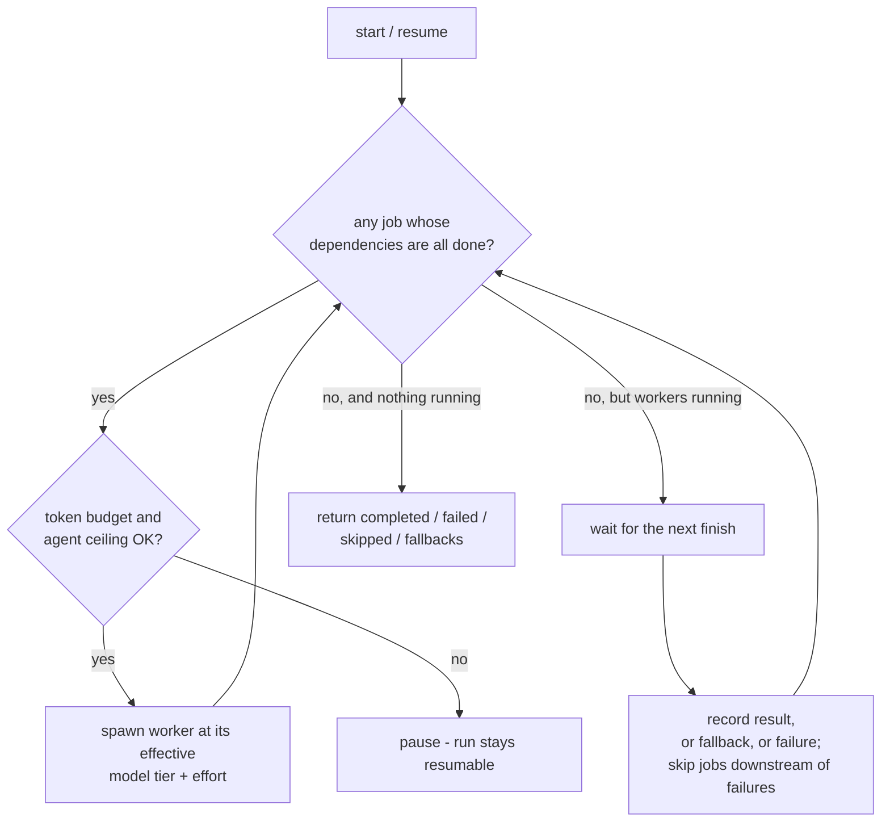
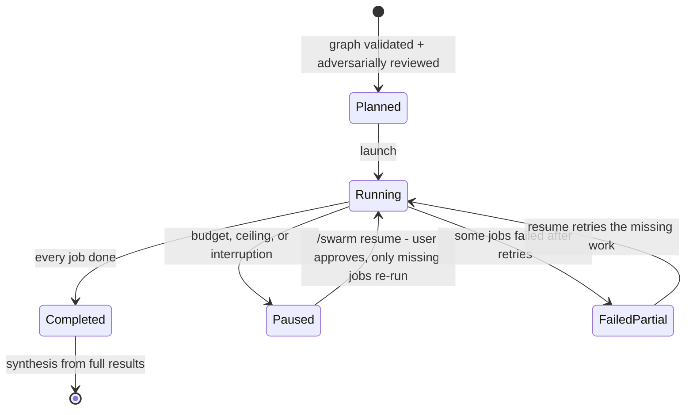

# swarm

[](https://github.com/varmabudharaju/swarm/actions/workflows/ci.yml)
[](LICENSE)
[](pyproject.toml)

**A foreman for teams of AI agents.**

Give [Claude Code](https://claude.com/claude-code) one big goal — *"audit this codebase for bugs"*, *"migrate every endpoint to the new API"* — and swarm breaks it into a map of small jobs, hires a team of AI workers to run them in parallel on the cheapest model that fits each job, saves every finished job to disk, and survives any interruption. Close the laptop mid-run; resume tomorrow without redoing finished work.

```bash
pip install -e . && swarm install        # then: /swarm <goal> inside Claude Code
```



## Why swarm exists

One assistant doing a huge task alone has three problems:

1. **It's slow.** Reading 60 files happens one file at a time.
2. **It forgets.** By file 40, file 3 has fallen out of context, and quality quietly degrades.
3. **It's expensive in the wrong places.** The same top-tier model that designs your API also greps for TODO comments.

And the naive fix — "just spawn a bunch of agents" — creates new problems: agents that step on each other's files, work that vanishes when a rate limit hits at agent 7 of 9, plausible-but-wrong results that nobody checked, and a token bill with no ceiling.

swarm is the set of decisions that make parallel agent work **fast, cheap, durable, and checked**. Every one of those decisions is documented below, with its reasoning.

## The idea, in plain words

swarm works the way a good engineering team does:

1. **Plan the work as a map, not a to-do list.** Each job declares exactly which other jobs it needs results from. Anything that *can* run in parallel *does*.

   ```mermaid
   flowchart TB
       a["scan the routes<br/>(worker 1)"] --> v["verify the findings<br/>(worker 4)"]
       b["scan the auth code<br/>(worker 2)"] --> v
       c["scan the database layer<br/>(worker 3)"] --> v
       v --> s["write the final report"]
   ```

   Workers 1, 2 and 3 run at the same time; the verifier starts the moment all three finish.
2. **Give each worker a sealed envelope.** Workers don't share a conversation; each gets a self-contained instruction packet. A stranger could pick up the envelope and do the job — that's the test.
3. **Save every finished job immediately.** A hook (not the worker itself) writes each result to disk the moment the worker stops. Crash, rate limit, closed laptop — finished work is never lost.
4. **Resume by asking, never by guessing.** The next session notices the unfinished run, reports *exactly* what's done and what remains, and re-runs only the missing jobs after you approve.
5. **Right-size every brain.** The foreman picks the cheapest model tier and effort level that fits each job.
6. **Check the work twice.** An adversarial reviewer attacks the *plan* before launch, and an adversarial verifier attacks the *results* before you see them.

## Use cases

| Goal | Shape swarm gives it |
|---|---|
| **Audit / review** — "find the bugs in this codebase" | N parallel scanners (one per subsystem) → cluster verifiers that try to *refute* each finding → one synthesis. Only verified findings reach you. |
| **Migration / sweep** — "move every endpoint to the new API" | One implement worker per site, each in its own quarantined git worktree and branch → an integrate task merges and runs the full suite → you approve the final merge. |
| **Research** — "compare these five approaches" | Parallel readers with different lenses → adversarial verification of claims → cited synthesis. |
| **Fix pipeline** — "here's an audit report; fix everything" | Findings grouped by file ownership → parallel implementers with *disjoint* file sets (zero merge conflicts by construction) → integrate → verify each original bug is actually dead. |
| **Anything interrupted** — rate limit at job 7 of 9 | `/swarm resume` next session re-runs only jobs 8 and 9. |

The last two are not hypothetical — swarm ran both against **itself** (see [Proven in the field](#proven-in-the-field)).

## Feature map

| Feature | What it gives you |
|---|---|
| Dependency-graph execution | Maximal honest parallelism; no artificial phases |
| Model ladders (`economy`/`duo`/`premium`) | Per-run cost policy, chosen once, enforced everywhere |
| Per-task model + effort tiers | Two independent economy levers per job |
| Hook-written checkpoints | Interruption never loses finished work |
| Ask-first resume with lock | No silent re-runs, no two sessions fighting over one run |
| Content-hashed run state | Tampered graphs refuse to resume — correctly |
| Adversarial plan gate | Bad decompositions die before costing tokens |
| Adversarial result verification | Plausible-but-wrong output dies before reaching you |
| Worktree quarantine for code changes | Your branch is untouched until you approve the merge |
| Budget / ceiling / rate-limit awareness | Runs pause resumably instead of blowing through limits |
| `swarm gc` | Reclaims old finished runs; dry-run by default |

## What a run looks like



## Right-sized brains (model ladders + effort)

Every run picks a **model ladder** first — the foreman asks once at launch (or you name it in the goal):

| Ladder | Models | Top tier (judgment/synthesis) |
|---|---|---|
| `economy` (default) | haiku, sonnet, opus | opus |
| `duo` | sonnet, opus | opus |
| `premium` | haiku, sonnet, opus, fable | fable |

The choice is written into `graph.json` as `allowed_models`, folded into the tamper-evident hash, enforced by validation, and honored on resume. Run your main (foreman) session on **Opus with extended thinking** — decomposition and synthesis inherit it.

Each job can also carry an **effort tier** (`low` | `medium` | `high` | `xhigh` | `max`) — the second economy lever, orthogonal to the model: mechanical checks run at `low`, judgment tasks inherit the session's effort, and the setting survives model-fallback retries.

Within the ladder, every job carries a model tier — chosen by the foreman per job, weighing quality stakes, ambiguity, complexity, and token cost. **Lowest tier that fits:**

| Tier | Right for |
|---|---|
| top of your ladder (inherit) | decomposition, ambiguous goals, final synthesis |
| `opus` | real coding: implementing, debugging, refactoring |
| `sonnet` | clear-goal bounded work: scans, reviews, adversarial verification |
| `haiku` | mechanical checks, extraction, formatting |



Three safety layers behind the judgment call:

- **Safety-net defaults** — untagged jobs get a sensible tier by type (research/review/verify → sonnet; implement/integrate → opus; synthesize → inherit), clamped into the run's ladder and then capped at the launching session's own tier — the cap wins, so a session never silently escalates above itself.
- **Failure fallback** — if a tier is unavailable or keeps failing, the final retry runs on the session model (always available), and the run report names every job that didn't run on its intended tier (`design-api: opus->inherit`). Loud, never silent.
- **Validation** — unknown model names, malformed ladders, and jobs tagged outside the run's ladder are all rejected before launch, identically by the Python and Node validators.



## Design decisions, and why

Every load-bearing choice in swarm, with its reasoning and its cost. These are the answers to "why is it built this way?"

**1. A dependency graph, not a to-do list.**
*Why:* a to-do list serializes everything; a graph runs every job whose inputs exist. Deps are **data dependencies** ("the verifier consumes these three scan results"), never phases ("step 2 after step 1") — phase barriers waste the fast workers' time waiting for the slowest.
*Cost:* the foreman must decompose honestly; the validator flags barrier smells (a task depending on an entire cohort with a thin prompt) and fan-in mush (more than 8 dependencies).

**2. Sealed packets instead of a shared conversation.**
*Why:* shared context is the thing that breaks at scale — workers poison each other, and nothing is reproducible. Each worker gets one self-contained packet file; if a stranger couldn't do the job from the packet alone, the packet is wrong. This also makes every job re-runnable in isolation, which is what makes resume possible at all.
*Cost:* the foreman writes more up front. Worth it: packet-writing is where decomposition errors surface early.

**3. Workers never save their own results — a hook does.**
*Why:* a worker that crashes mid-save loses its work; a worker that must remember to save sometimes won't. The SubagentStop hook fires *outside* the worker the moment it stops and writes `results/<task>.json`. A crash can interrupt a job, but can never lose a finished one. This is the single decision that makes runs unkillable.
*Cost:* results carry a version/task/hash envelope so stale or foreign files are detected and ignored.

**4. Resume asks; it never guesses.**
*Why:* silently re-running half a swarm is how you double-spend tokens or duplicate side effects. On resume, swarm scans checkpoints, verifies each against the graph hash, reports *exactly* what's done and what remains, and relaunches only after you approve. A resume lock (with staleness expiry) stops two sessions from resuming the same run concurrently.
*Cost:* one confirmation question. Deliberate.

**5. Run state is bound to a content hash of the graph.**
*Why:* if you edit the graph after results exist, those results describe jobs that no longer exist — resuming would mix incompatible work. Every checkpoint embeds the graph hash; a mismatch refuses to resume, loudly and correctly. The model policy (`allowed_models`) is folded into the hash too — changing the run's cost policy after the fact is also tampering. The fold is order-normalized (a reserialized list can't produce a spurious mismatch) and only applied when the field is present, so pre-ladder runs keep their original hashes and stay resumable.
*Cost:* fixing a bad graph mid-run means starting a new run. That's the point.

**6. Model policy is chosen per run, stored in the graph, and enforced — not suggested.**
*Why:* different runs deserve different cost ceilings, and a policy that lives only in a prompt is a policy that drifts. `allowed_models` is validated (non-empty, duplicate-free, known models, every explicit task model inside it), hashed, and honored by the executor: type-defaults are **clamped into the ladder** (nearest allowed tier above, else below), then **capped at the launching session's tier** — the cap wins, because running *cheaper* than the ladder floor is never a policy violation, but escalating above your own session silently would be.
*Cost:* one question at launch (skippable by naming the ladder in the goal).

**7. The failure fallback escapes the ladder — deliberately, and loudly.**
*Why:* when a tier is unavailable or failing, the choice is "fail the job" or "finish it on the session model" — the one model that is definitionally being served. swarm finishes the job and **reports it** in the run's `fallbacks` map. An invisible fallback would be a silent policy hole; a hard failure would sacrifice a run to a transient outage.
*Cost:* rare jobs may cost more than the ladder intended. You are always told which ones.

**8. Effort is a second, orthogonal lever.**
*Why:* model tier controls *which brain*; effort controls *how hard it thinks*. A mechanical check on haiku at `low` effort and a final adversarial verify on sonnet at `high` effort are both right-sized in a way one knob can't express. Effort deliberately survives the model fallback — a job that lost its tier shouldn't also lose its thinking budget.
*Cost:* one more per-task judgment; omission (inherit) is always safe.

**9. Adversarial gates on both ends of every run.**
*Why:* the two failure modes of agent swarms are bad plans and plausible-but-wrong results. Before launch, a verifier agent attacks the decomposition itself: missing tasks, fake parallelism, thin packets, mis-tiered jobs. After the work, verifier tasks attack the results: reproduce every claim, refute what doesn't hold. In swarm's own self-audit, the plan gate caught 4 findings no task owned and a fix that would have silently broken a committed fixture — before a single worker token was spent.
*Cost:* one extra agent per gate. The gate has paid for itself every time it has run.

**10. Code changes are quarantined in git worktrees; the merge is yours.**
*Why:* parallel implementers editing one checkout would trample each other, and an agent merging to your branch unsupervised is how repositories get ruined. Every implement job runs in an isolated worktree on its own branch; an integrate job merges the branches *in its own worktree* and runs the full suite; the final merge to your branch happens only in your session, only with your approval. Assigning implementers **disjoint file sets** makes merges conflict-free by construction.
*Cost:* worktree setup time per implement job — trivial next to a merge conflict between two agents.

**11. Hooks fail open.**
*Why:* the checkpointer and the plugin bootstrap run inside session lifecycle events. A hook that crashes takes the session down with it — so every hook path catches everything, logs one line to `~/.claude/swarm/swarm.log`, and gets out of the way. Reliability of *your session* outranks reliability of *swarm's bookkeeping*.
*Cost:* a broken bootstrap surfaces in the log instead of your face. The log line says exactly what failed.

**12. Two validators that mirror each other, in two languages.**
*Why:* the graph is authored and validated in Python (`swarm validate`) but executed by a Node scheduler — and a graph the executor accepts but the CLI rejects (or vice versa) is a policy bypass. Both validators enforce the same contract (ids, cycles, fan-in ≤ 8, schema caps, model allow-list, ladder membership, task types), and the test suites pin them to each other. When in doubt, Python's contract wins.
*Cost:* every rule is written twice. The self-audit proved why: the Node side had silently drifted on two rules, and the divergence was a real policy hole.

**13. Least-privilege workers.**
*Why:* a reader that *can't* write and a verifier that *can't* push can't be tricked into doing either. `swarm-reader` is read-only; `swarm-verifier` can run tests but not modify; `swarm-implementer` can code but not push or fetch arbitrary URLs.
*Cost:* occasionally a worker legitimately needs a tool it lacks — it documents the blocker in its result, and the pipeline (integrate step) absorbs it. This exact case happened in production and lost nothing.

**14. Destructive operations are dry-run by default.**
*Why:* `swarm gc` lists what it *would* delete and requires `--delete` to act; it only ever considers **terminal** runs (completed/abandoned — `failed-partial` needs an explicit flag), older than `--days`, not holding a fresh resume lock. Uninstall restores the one-time backup of your original settings. A tool that manages your `~/.claude` must be paranoid about it.
*Cost:* one extra flag when you really mean it.

## Proven in the field

**Run 1 — auditing a sibling tool.** swarm's first production run reviewed [tend](https://github.com/varmabudharaju/tend): 6 specialized reviewers, 2 independent verifiers that reproduced every claim against the installed binary, then synthesis. Deliberately interrupted at 4/9 tasks and resumed in a different session: the 4 finished tasks short-circuited, only the 5 missing ones ran. Output: 33 confirmed findings (2 high-severity), every one fixed in tend v0.2.

**Runs 2 & 3 — swarm audited and repaired itself.** A 10-task economy-ladder audit of this very repo (6 sonnet scanners + 1 haiku checker → 2 sonnet verifiers → opus synthesis, **zero fallbacks**) produced 31 adversarially-confirmed findings. A 7-task fix swarm then remediated all of them: 5 implementers on disjoint files in quarantined worktrees → conflict-free integration → verification at `effort: high` that re-reproduced every original bug against the merged code — **22/22 fixed, zero regressions**, test suite grown 98 → 119. Two workers failed mid-run (one spawned without shell tools, one returned a junk summary); both had left correct work in their worktrees, the integrator absorbed it, and the verifier caught nothing missing. The checkpoint-and-quarantine design ate both failures without losing work.

Evidence with real screenshots for all three runs: [`docs/test-evidence.md`](docs/test-evidence.md).

## See it

| Mid-run | Completed | Resume nag | Fix swarm done |
|---|---|---|---|
|  |  |  |  |

## Install

**As a Claude Code plugin** (recommended):

```
/plugin marketplace add varmabudharaju/swarm
/plugin install swarm@swarm
```

Skill, agents, and hooks register automatically; the `swarm` CLI lands on your PATH, and the run workflow is bootstrapped on session start. Restart your session, then `/swarm <goal>`.

**Or via pip** ([`ctx-swarm` on PyPI](https://pypi.org/project/ctx-swarm/)):

```bash
python3 -m pip install --user ctx-swarm     # or, for development: pip install -e .
swarm install        # hooks into settings.json; copies skill/workflow/agents
# restart your Claude Code session
```

Then in Claude Code: `/swarm <goal>` — or `/swarm resume` after an interruption.

Notes: both paths need `python3` on your `PATH` (the plugin's shim falls back to `python`). Wheels are self-contained — the install assets ship inside the package (`swarm_lib/_assets`), and a checkout/editable install always wins over the packaged copy so dev edits take effect. If you already run the plugin, `swarm install` detects it and skips hook registration so events don't fire twice.

## Pieces

| Piece | Where it lands | Role |
|---|---|---|
| `swarm` skill | `~/.claude/skills/swarm/` | decomposition + resume protocol |
| `swarm-run` workflow | `~/.claude/workflows/swarm-run.js` | pure DAG scheduler (generated) |
| worker agents | `~/.claude/agents/swarm-*.md` | least-privilege reader/verifier/implementer |
| hooks | settings.json (SubagentStop, SessionStart); plugin installs get the same two natively from `hooks/hooks.json` via `${CLAUDE_PLUGIN_ROOT}`, without touching settings.json | checkpoints + resume nag + workflow bootstrap |
| run state | `~/.claude/swarm/runs/<project>/<run-id>/` | graph, packets, results, state |

## CLI

```bash
swarm validate <graph.json> [--print-hash]
swarm args <graph.json> [--resume] [--session-model <tier>]
swarm status <run-dir>
swarm finish <run-dir> --status completed|paused_for_budget|failed-partial
swarm abandon <run-dir>
swarm gc [--days N] [--include-failed] [--delete]   # reclaim old finished runs (dry-run by default)
swarm install / swarm uninstall
swarm install-workflow [--claude-dir <dir>]   # plugin bootstrap: writes only the workflow file
```

## Guardrails

- **Graphs are validated before launch** (unique ids, no cycles, fan-in ≤ 8, schema checks, model + effort allow-lists, ladder membership) and **adversarially reviewed** by a verifier agent that attacks the decomposition itself.
- **Implement jobs are quarantined** in isolated git worktrees on their own branches; the merge to your branch happens only in your session, only with your approval.
- **Budget- and ceiling-aware**: the executor pauses (resumably) instead of blowing through token budgets or agent ceilings; the foreman checks rate-limit headroom (via tend) before launching at all.
- **Tamper-evident state**: results are bound to a content hash of the graph (including the model policy); editing either after results exist correctly refuses to resume.
- **Reversible install**: a one-time backup of your pre-swarm settings.json (`settings.json.bak-swarm`) is written at first install and restored/removed at uninstall; non-dict or corrupted settings are refused, never silently overwritten.

Worker activity is audited machine-wide by [agent-pd](https://github.com/varmabudharaju/agent-pd) (hash-chained per-session logs in `~/.claude/pd/audit/`).

## Managed paths

`swarm install` owns these locations and will overwrite/delete them on reinstall/uninstall — do not hand-edit: `~/.claude/skills/swarm/`, `~/.claude/agents/swarm-{reader,verifier,implementer}.md`, `~/.claude/workflows/swarm-run.js` (generated; edit sources in this repo), and `~/.claude/settings.json.bak-swarm` (one-time pre-swarm backup, removed on uninstall).

## Under the hood

### System design — who talks to whom



### The scheduler loop

What `runGraph()` does until the run is over. Note there is no width cap in the scheduler itself — every deps-satisfied job launches, throttled only by the agent ceiling, the token budget, and the workflow runtime's concurrency slots (~16).



### The life of a run



### Modules

```
swarm_lib/        Python: CLI, graph validation/hashing, checkpoint hook,
                  run state, gc, marker protocol, reversible installer
workflows/        run_graph.mjs - pure DAG scheduler (no runtime deps,
                  Node-testable, embedded into the installed workflow)
skills/swarm/     the /swarm skill + graph-format / packet / shape references
agents/           swarm-reader, swarm-verifier, swarm-implementer definitions
tests/            pytest suite + node:test scheduler suite (119 tests)
```

Tests: `python3 -m pytest` (Python; also drives the Node suite).

## Known limitations

- **Single machine.** Run state, worktrees, and hooks all assume one host.
- **`python3` (or `python`) must be on PATH** for the plugin's hooks and CLI shim.
- The `bin/swarm` shim's no-env fallback resolves relative to the script's own path; if a host exposes plugin binaries by *symlinking* them into a shared directory, set `CLAUDE_PLUGIN_ROOT` (the plugin runtime does this).

Sibling project: [tend](https://github.com/varmabudharaju/tend) — context hygiene for the session that *runs* swarm; swarm reads tend's rate-limit tee to size launches.
