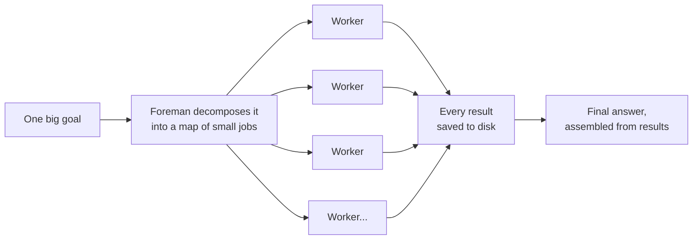
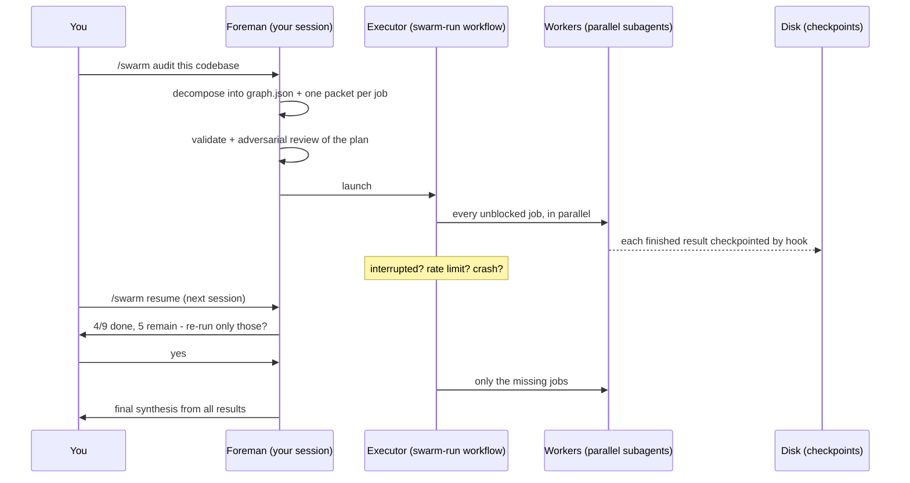
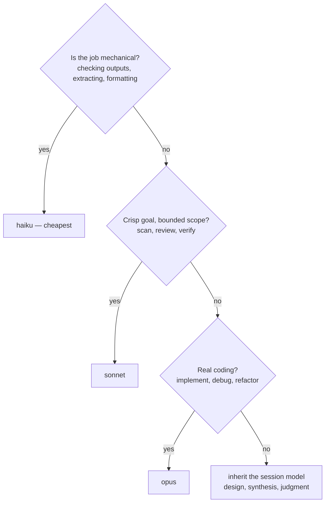
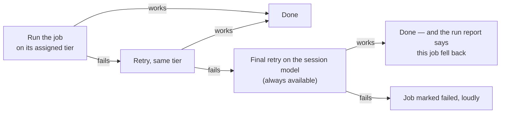
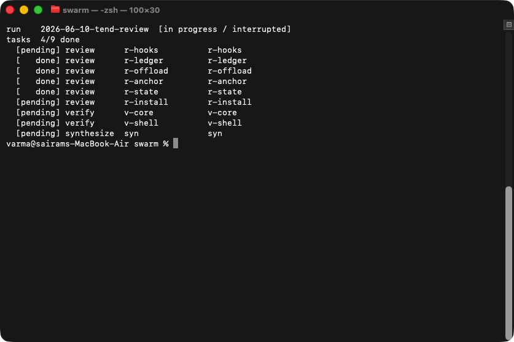
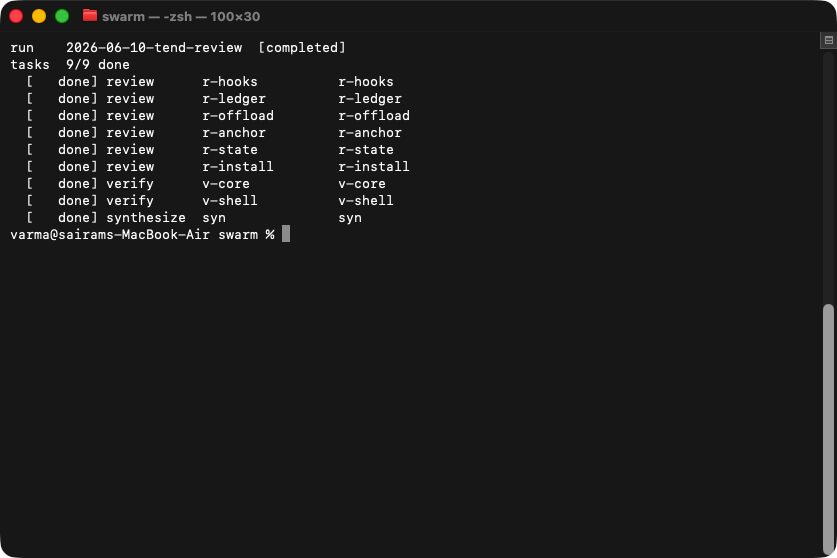
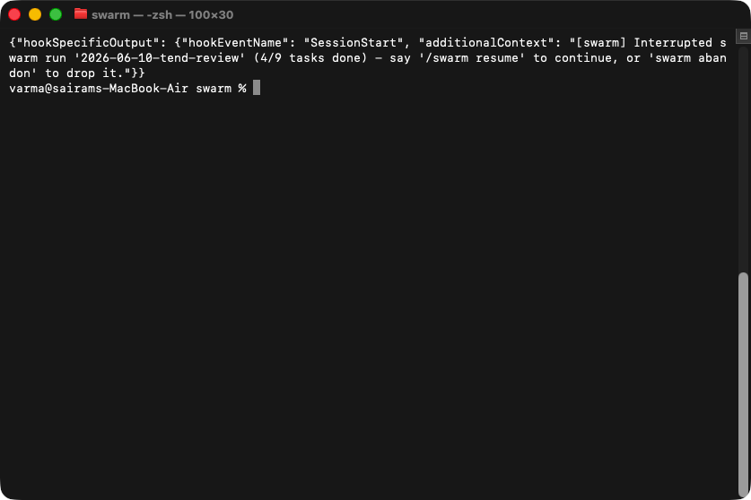
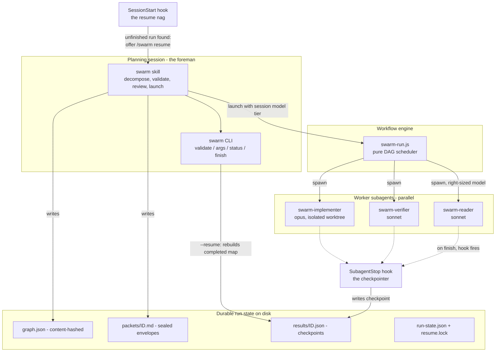
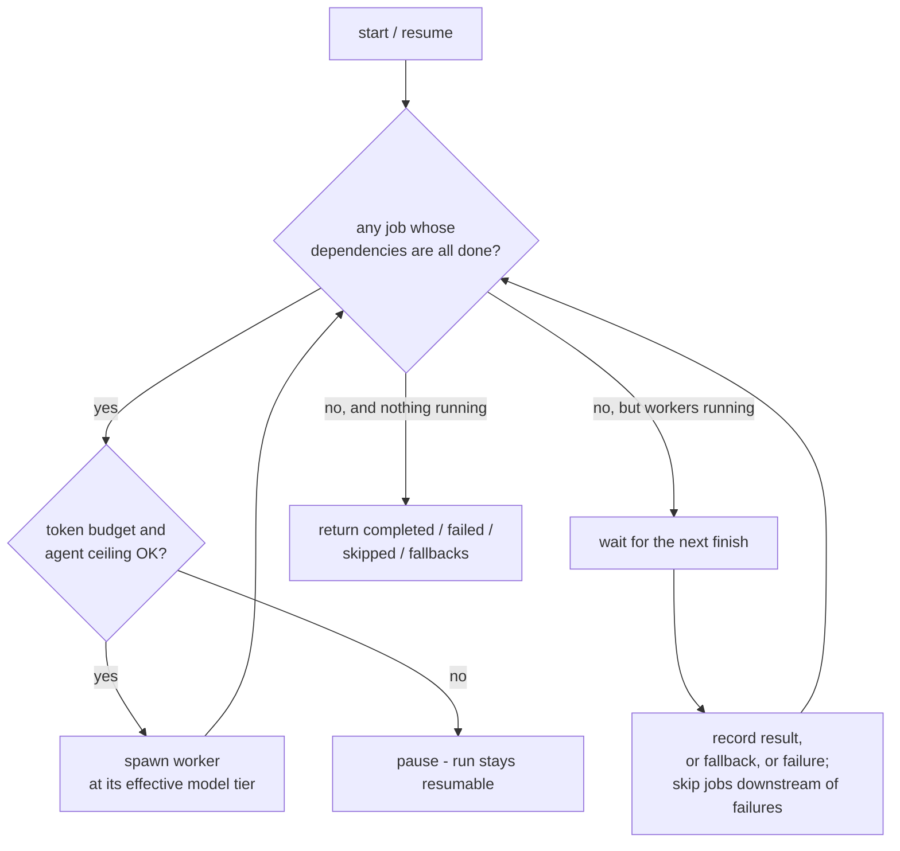
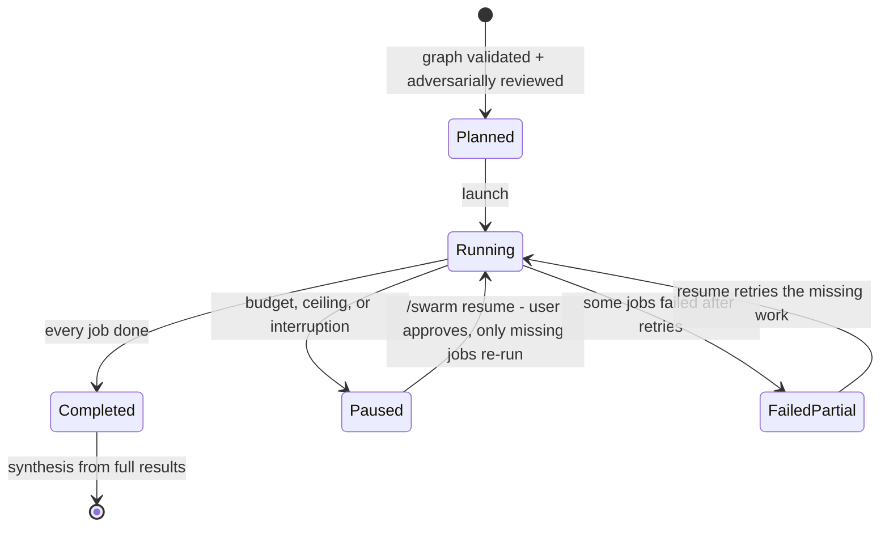

# swarm

[](https://github.com/varmabudharaju/swarm/actions/workflows/ci.yml)
[](LICENSE)
[](pyproject.toml)

**A foreman for teams of AI agents.**

Give [Claude Code](https://claude.com/claude-code) one big goal — *"audit this codebase for bugs"*, *"migrate every endpoint to the new API"* — and swarm breaks it into a map of small jobs, hires a team of AI workers to run them in parallel, saves every finished job to disk, and survives any interruption. Close the laptop mid-run; resume tomorrow without redoing finished work.



## The idea, in plain words

One assistant doing a huge task alone is slow and forgetful — like one person reading a 60-file codebase cover to cover. swarm works the way a good team does:

1. **Plan the work as a map, not a to-do list.** Each job says exactly which other jobs it needs results from. Anything that *can* run in parallel *does* — 10 readers fan out across the codebase at once.

   A to-do list runs one job at a time. A map runs everything whose ingredients are ready:

   ```mermaid
   flowchart TB
       a["scan the routes<br/>(worker 1)"] --> v["verify the findings<br/>(worker 4)"]
       b["scan the auth code<br/>(worker 2)"] --> v
       c["scan the database layer<br/>(worker 3)"] --> v
       v --> s["write the final report"]
   ```

   Workers 1, 2 and 3 run at the same time; the verifier starts the moment all three finish.
2. **Give each worker a sealed envelope.** Workers don't share a conversation; each gets a self-contained instruction packet. A stranger could pick up the envelope and do the job — that's the test.
3. **Save every finished job immediately.** A hook (not the worker itself) writes each result to disk the moment the worker stops. Crash, rate limit, closed laptop — finished work is never lost.
4. **Resume by asking, never by guessing.** The next session notices the unfinished run, reports *exactly* what's done and what remains, and re-runs only the missing jobs after you approve.
5. **Right-size every brain.** A mechanical check doesn't need the most expensive model. The foreman picks the cheapest model tier that fits each job (details below).

## What a run looks like



## Right-sized brains (model tiering)

Every job in the graph carries a model tier — chosen by the foreman per job, weighing quality stakes, ambiguity, complexity, and token cost. **Lowest tier that fits:**

| Tier | Right for |
|---|---|
| top model (inherit) | decomposition, ambiguous goals, final synthesis |
| `opus` | real coding: implementing, debugging, refactoring |
| `sonnet` | clear-goal bounded work: scans, reviews, adversarial verification |
| `haiku` | mechanical checks, extraction, formatting |

How the foreman picks, as a decision tree:



Three safety layers behind the judgment call:

- **Safety-net defaults** — untagged jobs get a sensible tier by type, capped at the launching session's own tier (an opus session never silently escalates to the premium model).
- **Failure fallback** — if a tier is unavailable or keeps failing, the final retry runs on the session model (always available), and the run report names every job that didn't run on its intended tier (`design-api: fable->inherit`). Loud, never silent.
- **Validation** — unknown model names are rejected before launch.

What happens when a tier misbehaves:



## See it

| Mid-run | Completed | Resume nag in a fresh session |
|---|---|---|
|  |  |  |

## Proven in the field

swarm's first production run reviewed its own sibling tool: a 9-agent adversarial audit of [tend](https://github.com/varmabudharaju/tend) — 6 specialized reviewers, 2 independent verifiers that reproduced every claim against the installed binary, then synthesis. The run was deliberately interrupted at 4/9 tasks and resumed in a different session: the 4 finished tasks short-circuited, only the 5 missing ones ran. Output: 33 confirmed findings (2 high-severity), every one of which was fixed in tend v0.2. Evidence with screenshots: [`docs/test-evidence.md`](docs/test-evidence.md).

## Install

```bash
python3 -m pip install --user -e .
swarm install        # hooks into settings.json; copies skill/workflow/agents
# restart your Claude Code session
```

Then in Claude Code: `/swarm <goal>` — or `/swarm resume` after an interruption.

## Pieces

| Piece | Where it lands | Role |
|---|---|---|
| `swarm` skill | `~/.claude/skills/swarm/` | decomposition + resume protocol |
| `swarm-run` workflow | `~/.claude/workflows/swarm-run.js` | pure DAG scheduler (generated) |
| worker agents | `~/.claude/agents/swarm-*.md` | least-privilege reader/verifier/implementer, tiered models |
| hooks | settings.json (SubagentStop, SessionStart) | checkpoints + resume nag |
| run state | `~/.claude/swarm/runs/<project>/<run-id>/` | graph, packets, results, state |

## CLI

```bash
swarm validate <graph.json> [--print-hash]
swarm args <graph.json> [--resume] [--session-model <tier>]
swarm status <run-dir>
swarm finish <run-dir> --status completed|paused_for_budget|failed-partial
swarm abandon <run-dir>
swarm install / swarm uninstall
```

## Guardrails

- **Graphs are validated before launch** (unique ids, no cycles, fan-in caps, schema checks, model allow-list) and **adversarially reviewed** by a verifier agent that attacks the decomposition itself: missing tasks, fake parallelism, thin packets, over- or under-provisioned model tiers.
- **Implement jobs are quarantined** in isolated git worktrees on their own branches; the merge to your branch happens only in your session, only with your approval.
- **Budget- and ceiling-aware**: the executor pauses (resumably) instead of blowing through token budgets or agent ceilings.
- **Tamper-evident state**: results are bound to a content hash of the graph; editing the graph after results exist correctly refuses to resume.

Worker activity is audited machine-wide by [agent-pd](https://github.com/varmabudharaju/agent-pd) (hash-chained per-session logs in `~/.claude/pd/audit/`).

## Managed paths

`swarm install` owns these locations and will overwrite/delete them on reinstall/uninstall — do not hand-edit: `~/.claude/skills/swarm/`, `~/.claude/agents/swarm-{reader,verifier,implementer}.md`, `~/.claude/workflows/swarm-run.js` (generated; edit sources in this repo).

## Under the hood

### System design — who talks to whom



The trick that makes runs unkillable: **workers never save their own results.** A hook outside the worker writes the checkpoint the moment each worker stops — so a crash can interrupt a job, but never lose a finished one.

### Flow chart — the scheduler loop

What `runGraph()` does until the run is over:



### State diagram — the life of a run



### Modules

```
swarm_lib/        Python: CLI, graph validation/hashing, checkpoint hook,
                  run state, marker protocol, reversible installer
workflows/        run_graph.mjs - pure DAG scheduler (no runtime deps,
                  Node-testable, embedded into the installed workflow)
skill/            the /swarm skill + graph-format / packet / shape references
agents/           swarm-reader, swarm-verifier, swarm-implementer definitions
tests/            pytest suite + node:test scheduler suite
```

Tests: `python3 -m pytest` (Python; also drives the Node suite).

Sibling project: [tend](https://github.com/varmabudharaju/tend) — context hygiene for the session that *runs* swarm; swarm reads tend's rate-limit tee to size launches.
