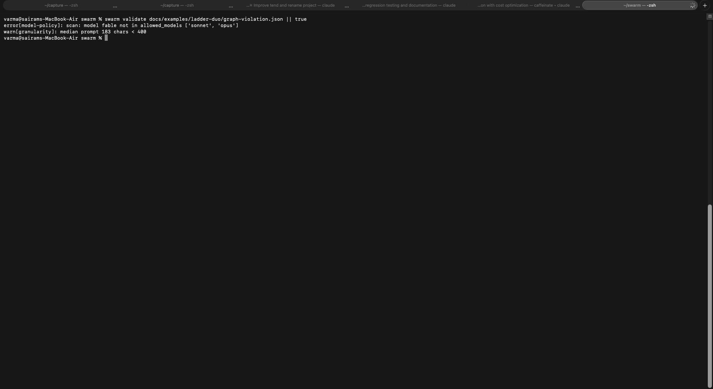
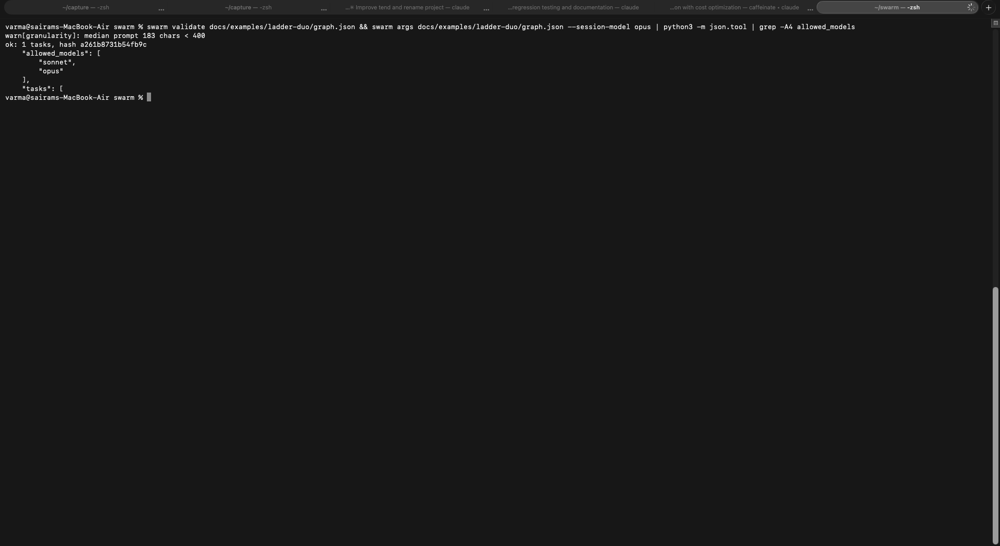
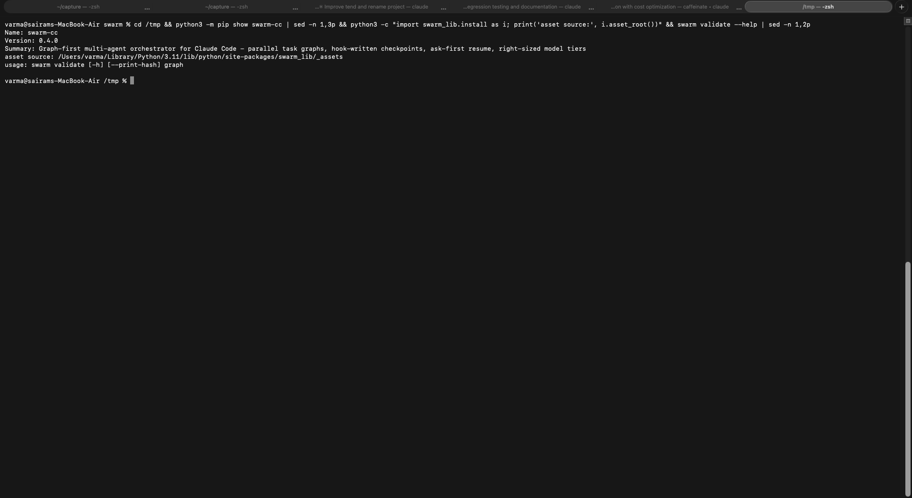

# swarm — test evidence

Date: 2026-06-10 · branch `build/v1` · 72 Python tests + 19 Node scheduler tests passing.

## Suites

- `python3 -m pytest -q` → 72 passed (paths, marker, extract, graph validation,
  runs/locks, hooks, installer, CLI, integration incl. subprocess entry points).
- `node --test 'tests/node/*.test.mjs'` → 19 passed (max-parallelism, dependency
  order, no-double-launch, transitive skip, throw containment, budget
  reservation + pause, null disambiguation, ceiling incl. 0, resume
  short-circuit, id charset, schema gate, sentinel identity).

## Live install (real `~/.claude`)

`swarm install` merged hooks non-destructively — SubagentStop: agent-pd + tend +
swarm; SessionStart: tend + swarm; statusline and all other settings untouched.
Skill, generated workflow, and 3 agent definitions landed in their managed
paths. The `swarm` skill and `swarm-run` workflow registered live mid-session;
custom agent *types* require a session restart (verified by probe; documented in
the skill).

## Task 0 spike (design-critical)

SubagentStop fires for workflow agents (`agent_type: workflow-subagent`) with
`agent_transcript_path` + `last_assistant_message` — verified in agent-pd audit
logs. Hook-written checkpointing is therefore sound for workflow workers.

## End-to-end demo: review swarm over /Users/varma/tend (9 tasks)

Graph: 6 parallel reviewers → 2 cluster verifiers → 1 synthesizer. Authored per
the skill: packets per task, `swarm validate` (clean), adversarial graph-review
gate (found schema-enforcement gaps — fixed before launch).

1. **Launch**: all 6 reviewers ran concurrently (live in `/workflows` view).
   First-launch failure was itself a product fix: args arrived stringified →
   footer now parses string args (committed).
2. **Checkpoints**: results/<id>.json files appeared mid-run, written by the
   SubagentStop hook with zero worker cooperation.
   
3. **Interrupt**: workflow killed (TaskStop) at 4/9 — simulating a rate-limit
   death. `swarm status` showed exact partial state from disk. The SessionStart
   nag a fresh session would see:
   
4. **Resume**: `swarm args --resume` took the lock and rebuilt the completed
   map; re-invoked workflow short-circuited 4 tasks instantly — `v-core`
   launched immediately (cluster already complete). Exactly 5 agents ran on the
   resumed leg (engine usage: agent_count=5).
5. **Finish**: 9/9 done, `swarm finish --status completed`, nag silenced.
   

## Demo output (real value, not synthetic)

The demo run produced a verified review of tend: 39 findings from 6 reviewers,
adjudicated by 2 verifiers → **31 confirmed (2 high), 4 refuted, 2 uncertain**.
Full synthesized report: `/Users/varma/tend/docs/swarm-review-2026-06-10.md`.
Highlights: ledger partial-line read can permanently lose records; negative
`tokens_since_state_mark` after `/compact` silently disables the staleness net;
offloaded dict tool-responses are saved as one JSON line (Read offset/limit
can't navigate); uninstall can drop a co-resident hook entry. These feed tend
v0.2.

## Per-run model ladders (2026-07-07, branch `feat/model-ladders`)

Suites: `python3 -m pytest -q` → **87 passed** (68 Python + 19→24 Node scheduler
tests incl. 11 new: allowed_models validation/hash coverage, args passthrough,
clampToLadder, policy enforcement in validateGraph/runGraph).

End-to-end through the installed CLI, captured as real Terminal screenshots
(`shotlist run`, fixtures in `docs/examples/ladder-duo/`):

1. **Policy enforced before launch** — a `fable`-tagged task in a
   `duo` (sonnet+opus) run is rejected with `error[model-policy]`:
   
2. **Happy path + executor handoff** — the corrected `opus`-tagged graph
   validates (`ok: 1 tasks, hash a261b8731b54fb9c` — note the hash covers
   `allowed_models`) and `swarm args` emits the policy to the workflow:
   

## Self-hosted audit -> fix pipeline (2026-07-07, v0.3 ladders + effort)

Two production swarm runs against swarm itself, exercising per-run model
ladders (economy: haiku/sonnet/opus), per-task effort, the adversarial review
gate, and worktree-quarantined implement tasks end to end.

1. **Audit run** (`2026-07-07-v03-audit`, 10 tasks, 0 fallbacks): 6 parallel
   sonnet scanners + 1 haiku mechanical checker -> 2 sonnet verifiers -> opus
   synthesis. 32 findings -> **31 CONFIRMED / 1 uncertain / 0 refuted**. The
   pre-launch gate fixed 5 plan defects before any agent spawned.
2. **Fix run** (`2026-07-07-v03-fixes`, 7 tasks): 5 implementers in isolated
   worktrees on disjoint files -> integrate (zero conflicts) -> adversarial
   verify at effort=high: **22/22 FIXED, 0 regressions**, suite 98 -> 119
   tests, node 39/39. Two worker failures (one tooling-blocked, one junk
   summary) were absorbed: both left correct edits in their worktrees, the
   integrator committed them, the verifier re-reproduced every original bug
   against the merged code. The pre-launch gate returned FIX-FIRST and caught
   4 orphaned findings plus a fixture-hash regression the plan would have
   shipped.
   

Known descope: pyproject non-editable packaging still requires `pip install
-e .` or the plugin path; it now fails loud (SettingsError) instead of a raw
traceback.

## PyPI release verification (2026-07-08, v0.4.0 as swarm-cc)

`swarm-cc 0.4.0` published via trusted publishing (publish.yml, all jobs
green). Verified on the real machine as a fresh user would: editable dev
install removed, `pip install swarm-cc` from the live index, `swarm install`
resolved its assets from INSIDE the wheel
(`site-packages/swarm_lib/_assets`) and landed skill/workflow/agents into
`~/.claude` - the audit's non-editable-install defect is dead in the shipped
artifact.

